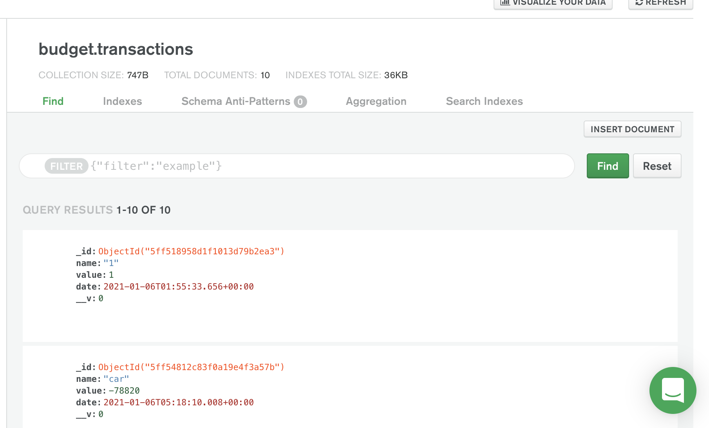

# budgetTracker
This app tracks the budget and helps the user to make the better financial planning. User can provide the information about different expenditures and gains in the app which then returns the current financial position. User can provide information even at the time of offline which will be 
updated automatically in bulk once the user is online.

## Contents
The app consists of 1 main file server.js. The special file in this projects are .webmanifest and service-worker.js which helps the app to work even in offline mode. The data are stored in mongodb atlas using mongoose. The app is also hosted in heroku and github.

## usage
To use this applicaton, git clone this repository, run 'npm init' and npm install to install the following dependencies:

- Express
- Morgan
- dotenv
- mongoose
- compression

The app can be invoked using npm start or node server.js

## User Story
As a user, I  want something such that I can keep updating all my financial expenditure and earnings even when I am offline in order to always remain in position to know my financial conditions.

## Links to the application
- Github repository link: (https://github.com/ManNeu/budgetTrackers)
- Heroku deployed link: (https://bud-get-tracker.herokuapp.com/)

## Screenshots

## Built With
- VS Code - (https://code.visualstudio.com/)
- Terminal
- Express
- Node
- mongoose

## License 
MIT License

## Author 
Manish Neupane  
Email: mrnish.are@gmail.com  
Github: https://github.com/ManNeu

